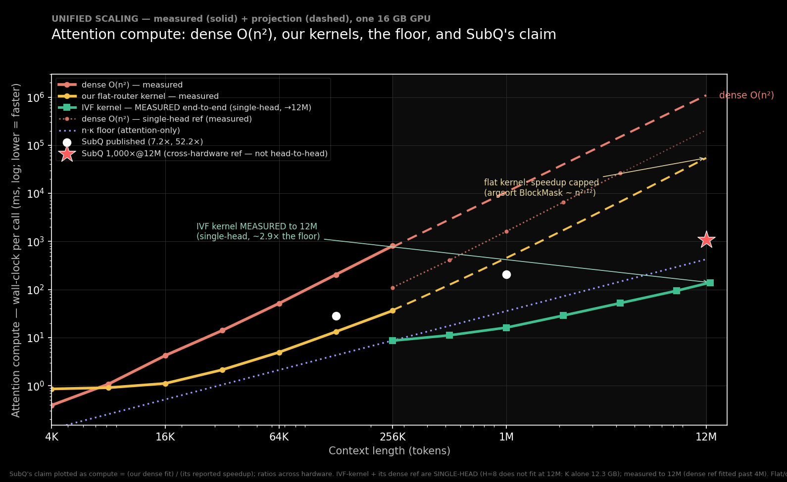

# Subquadratic Sparse Attention (SSA)

SSA is a research implementation of content-routed sparse attention for long contexts. For each query it
selects a small set of key blocks, adds a local causal window, and computes ordinary softmax attention over
the selected keys. The implementation avoids materializing the dense `n × n` attention matrix.

This repository is a working research artifact, not a production inference stack. Its strongest result is a
complete frozen Qwen2.5-0.5B prefill over **10,000,128 tokens** on one RTX Pro 6000. Its quality evidence at
that length is one semantic needle-in-a-haystack ranking, so the run establishes execution at scale rather
than broad quality preservation.

The full technical account is available as the [compiled paper](paper/subquadratic_attention.pdf),
[LaTeX source](paper/subquadratic_attention.tex), and [Markdown source](paper/subquadratic_attention.md).
Detailed experiment records live in [RESULTS.md](RESULTS.md).



## Current status

| Area | Status | Evidence and boundary |
|---|---|---|
| Complete transformer beyond 10M | **Demonstrated** | Qwen2.5-0.5B, all 24 layers, 14 query heads, 2 KV heads, one RTX Pro 6000 |
| Subquadratic long-context routing | **Demonstrated** | Fixed-beam center-radius tree in the complete run; FAISS-GPU IVF in the isolated kernel |
| Sparse attention execution | **Demonstrated** | Native GQA, causal local and routed blocks, exact softmax over the selected set |
| Quality at 10M | **Narrow evidence** | One semantic NIAH ranking passed; broad retrieval, perplexity, and multi-hop quality remain open |
| Dense equivalence | **Validated at small scale** | 4K dense-equivalence gate and dense/streamed 128K NIAH gates passed |
| Kernel scaling | **Measured to 12M** | Single-head synthetic IVF kernel: 139.5 ms, 6.55 GB, 2.9× the `n·κ` floor |
| Output-error certification | **Reference implementation** | CPU adaptive selectors bound omitted mass, KL, and attention-output error; no production GPU kernel claim |
| Lean-checked supporting invariants | **Verified abstractly** | Recursive balls, exact restricted-read/output identities, strict or index-tie-broken top selection, grounded read-budget limits, and the composed causal reservoir plan |
| Float32 tree bounds | **Guarded and stress-tested** | RTX 4080 comparison with float64 descendant oracles: zero guarded misses in 90,105 balls and 1,081,260 score caps; empirical, not an IEEE-arithmetic proof |
| Worst-case cheap losslessness | **Ruled out in the grounded-probe model** | A budget-`b` adaptive read returning only probed positions has uniform-spike recall at most `b/n`; arbitrary preprocessing is outside this theorem |
| Broad model quality | **Open** | No dense 10M baseline, long-context training, perplexity suite, or frontier-model evaluation |

## Complete 10M transformer result

[`ssa/streaming_qwen.py`](ssa/streaming_qwen.py) executes a memory-bounded Qwen prefill using layerwise K/V
lifetime, token-chunked projections and MLPs, native grouped-query attention, and a bounded hierarchical
router. [`ssa/kaggle_10m_runner.py`](ssa/kaggle_10m_runner.py) supplies equivalence and quality gates and is
packaged for the ARC3-attached Kaggle RTX Pro 6000 by [`kaggle_10m/`](kaggle_10m/).

The recorded run in [`runs/kaggle_10m_v5/ssa_10m_result.json`](runs/kaggle_10m_v5/ssa_10m_result.json) reports:

| Metric | Result |
|---|---:|
| Context | **10,000,128 tokens** |
| Model | Qwen2.5-0.5B, 494,032,768 parameters, bf16 |
| Execution | 24/24 layers, 14 query heads, 2 KV heads |
| Elapsed time | **713.2 s** |
| Throughput | **14,022 token/s** |
| Peak CUDA allocation | **25.72 GB** |
| Upper selected fraction | **0.506%** |
| 10M semantic probe | `walnut` 5.844; best distractor 4.438 — **pass** |

Routing uses pre-RoPE query/key content geometry to propose blocks and post-RoPE query/key vectors for the
actual attention scores. Layer 1 forms a cross-head consensus route; a bounded 128-block reservoir carries
high-vote evidence through later layers. Each query/head attends to at most 198 routed and local blocks. This
policy is an empirical retrieval mechanism, not a certificate of dense-equivalent output.

The static YaRN factor is approximately 306× the model's training range. That makes the successful probe
useful execution evidence but prevents treating it as a general long-context model-quality result.

## Algorithm and complexity

For block `c`, SSA uses the second-cumulant routing score

```text
r_c(q) = <q, μ_c> + (β/2) qᵀΣ_cq
```

and then evaluates standard softmax attention on the selected keys. If `κ` keys are selected per query, the
attention work is `O(nκ)`. A flat block router gives an `O(n√n)` operating point when block size and budget
scale as `√n`. A hierarchical or IVF router with fixed block size and fixed `κ` approaches linear work on
benign geometry. These are algorithmic or measured typical-case statements; worst-case exact routing can
still require a full scan.

A different subquadratic construction factors positions as `(block, slot)` and composes a within-block pass
with a same-slot cross-block pass. Every source can then reach every target in two hops, and a supplied cost
model proportional to `n(w + n/w)` is minimized at `w = √n`. This is a useful comparison, not SSA's
mechanism: complete structural reach does not imply dense-softmax equivalence. With either pass fixed, the
other ranges over a strict subspace of all token-mixing maps in the nondegenerate dimensions; no rank bound or
two-free-pass impossibility follows. Likewise, the scalar tree cost `f log_f B` is minimized continuously at
`e` and over integer fanouts at 3, but that model omits GPU utilization and beam quality. The measured 10M
tree therefore remains at fanout 16 pending a controlled benchmark.

The retrieval law

```text
w★ = σ(βΔ − log μ)
```

explains why selection can make recall insensitive to context length: it reduces the effective distractor
count `μ` from `n` to `κ`. The selector must still include the target. Coherent spans provide block-level
signal; isolated unit-norm needles can disappear inside summaries and are the principal adversarial case.

## Mathematical status

The repository contains two distinct guarantee levels:

- [`ssa/certified_attention.py`](ssa/certified_attention.py) adaptively opens blocks until it certifies an
  omitted-mass and/or attention-output tolerance, with a full-scan fallback.
- [`ssa/hierarchical_certified_attention.py`](ssa/hierarchical_certified_attention.py) applies the same target
  through a tree and can evaluate `O(log B)` summaries on concentrated geometry. Its worst case is `O(B)`.
- The fast budgeted routes in `streaming_qwen.py`, `ivf_kernel.py`, and the FlexAttention path are empirical;
  exact softmax over their selected set does not imply equality with dense attention.

The current ellipsoidal upper bound is

```text
<q, μ_c> + ρ_c √(qᵀΣ_cq + ε||q||²),    S_c = Σ_c + εI.
```

The `ε||q||²` term is required because `ρ_c` is measured in the metric of `S_c`. Samuelson's inequality gives
the tightest upper bound available from `(μ_c, Σ_c, b)` alone. On real transformer keys the exact covariance
bound can cost at least a full key scan, which is why the scalable implementation uses budgeted lossy routing.

Related algebraic results are machine-checked in the separate Substrate Lean development; the relevant audit
is through Substrate commit `130cae3e9`. The broader mapping between Substrate results and this code is
documented in [`docs/substrate_math_imports.md`](docs/substrate_math_imports.md). The checked results now
include recursive real-valued ball containment and its pairing cap, monotone expansion of the certified drop
set as a tree bound tightens, causal selection by cutting every routed set at the query's original position,
retention of every item with at least nine votes by a highest-count reservoir of capacity 128 when 14
selectors each contribute at most 70 items, and survival plus a uniform `W + C` cardinality bound for union
with a fixed carrier. The radial pairing cap is
attained when an extremal centre is aligned with the query and the corresponding boundary member is
realizable; these are sufficient hypotheses, not a necessary characterization. The per-centre cap is never
larger than the reach cap, and the plane witness exhibits a strict gap as large as the whole cap. No converse
states that nonalignment forces strictness or that equality forces alignment.

The same audit now covers the complete abstract restricted-read certificate: total variation equals omitted
share, selected-to-dense KL equals minus the log kept share, the reverse smoothed divergence is unbounded as
the omitted support vanishes, and both value-output certificate arms follow from an exact residual identity.
It also proves that admissible bounds plus strict skip/truncation conditions return the strict top set; without
a margin, a deterministic index order is required to name one top set. SSA now uses larger parent indices to
break exact routing-score ties. A separate adaptive-read theorem gives the `b/n` recall ceiling only for
selectors that return positions they actually probed, and extends it to finite randomized mixtures. Finally,
the reservoir retention, `roundWidth + 128` cap, past bound, and causal cut are checked together as one
composed plan. Retention remains conditional on nine pre-reservoir votes, and none of these facts proves
attention-output quality or runtime.

The audit also sharpens two boundaries used by this project. A routed set reused wholesale at every query is
generally non-causal; SSA is causal because the final attention relation masks by original token position,
including partially visible blocks. And RoPE's relative-offset algebra does not itself prove unbounded length
generalization: a phase band cannot acquire a nonzero winding inside less than one wavelength, while changing
its winding under a reschedule requires crossing the anti-aliasing margin somewhere. The 306× YaRN run is
therefore reported as measured execution and one retrieval outcome, not as a theorem of positional transfer.

The public paper does not require access to that separate repository: Appendix B of the
[Markdown source](paper/subquadratic_attention.md#appendix-b-self-contained-routing-invariants) and the
[compiled paper](paper/subquadratic_attention.pdf) reproduce the definitions, theorem statements, proofs,
counterexamples, and scope for these routing invariants. The private Lean commit is corroborating audit
provenance, not the only available mathematical argument.

These theorems verify the abstract exact-arithmetic components, not the complete Python/CUDA execution.
The production `CausalTree` now conservatively inflates every recursive radius and query/node score cap and
rounds the result toward `+∞`. On an RTX 4080,
[`ssa/float_tree_verification.py`](ssa/float_tree_verification.py) compared fanouts 2, 4, and 16 over ordinary,
scale-separated, large-offset, cancellation-heavy, and axis-aligned float32 geometries against float64
descendant oracles. The former formulas underestimated 8,701 of 90,105 radii and 367,480 of 1,081,260 caps;
the guarded production formulas had zero observed underestimates. A 65,536-leaf, 64-dimensional fanout-16
build took 0.433 ms guarded versus 0.223 ms raw. These are adversarial numerical measurements, not an
IEEE/CUDA proof, and they do not make fixed-beam routing an exact selector. Fixed-beam retrieval quality and
the premise that the measured 10M target received nine pre-consensus base-route votes remain empirical.

## Other measured evidence

- A flat block-sparse kernel is 20.6× faster than dense exact attention at `n=262,144` on synthetic keys.
- The FAISS-GPU IVF kernel reaches 12M tokens in 139.5 ms single-head and uses 6.55 GB; its decode path remains
  about 0.6 ms per step from 1M to 12M at fixed `κ`.
- A fused Qwen2.5-0.5B swap reaches 128K under YaRN. NIAH is preserved in the measured settings while the
  two-hop task degrades at tight budgets.
- Routability co-training reduces lossless branch-and-bound key reads from 26.5% to 4.2% on the controlled
  task.
- Staged adaptation reaches 32× the trained length at 0.979 SSA recall in a toy MQAR task.
- The 124M construction experiment ends within +1.2 perplexity of an equal-training dense control while
  attending to about 38% of keys. This constant fraction is still asymptotically quadratic.
- The Certified Causal Cascade's per-query routing certificate has zero observed violations in its clustered
  and random tests; it certifies top-`κ` under the routing metric, not omitted attention mass.
- Cross-layer route sharing from a middle donor layer reduces measured routing overhead from about 59% to 6%
  while preserving the single-needle probe. Sharing from layer 0 does not.

These results use different fixtures to isolate different claims. Only the complete 10M run combines a real
pretrained model, every layer and head, long context, subquadratic routing, sparse attention execution, and an
observed quality outcome in one experiment.

## Known limitations

- Cheap summary routing is not lossless for arbitrary keys.
- Complete graph reach in a factorized attention pattern is not dense-attention functional equivalence.
- A routed subset is causal only after it is cut or masked at each query's original position.
- Multi-hop, multi-needle, and low-margin retrieval are harder than single high-margin NIAH.
- The 10M run has one semantic ranking and no dense 10M reference.
- Qwen2.5-0.5B is frozen and extended far beyond its trained positional range.
- The 12M IVF speed result is single-head and uses synthetic geometry.
- The real-model 128K and 10M results do not establish production throughput or frontier-model behavior.
- The certified attention implementations are CPU references and may open every block.

## Quickstart

```bash
pip install -r requirements.txt
python -m ssa.ssa_demo
python -m ssa.niah_analysis
python -m ssa.staged_extension
python -m ssa.float_tree_verification
pytest ssa/tests
```

The core demos run on CPU. CUDA is required for the fused kernels and materially shortens the training demos.
Scripts using pretrained models also require `transformers`, `datasets`, and either a local model cache or
network access. The Kaggle 10M package is designed for internet-off execution with attached model and wheel
datasets; see [`kaggle_10m/README.md`](kaggle_10m/README.md).

## Repository map

| Path | Purpose |
|---|---|
| [`ssa/streaming_qwen.py`](ssa/streaming_qwen.py) | Complete memory-bounded Qwen prefill and tree routing |
| [`ssa/longctx_demo.py`](ssa/longctx_demo.py) | Dense/streamed Qwen gates at 32K–128K |
| [`ssa/ivf_kernel.py`](ssa/ivf_kernel.py) | FAISS-GPU IVF routed FlexAttention benchmark |
| [`ssa/cascade_router.py`](ssa/cascade_router.py) | Certified Causal Cascade selector |
| [`ssa/float_tree_verification.py`](ssa/float_tree_verification.py) | CUDA float32 tree-bound stress test against float64 oracles |
| [`ssa/certified_attention.py`](ssa/certified_attention.py) | Adaptive mass/KL/output certificate |
| [`ssa/hierarchical_certified_attention.py`](ssa/hierarchical_certified_attention.py) | Hierarchical certificate reference |
| [`ssa/train.py`](ssa/train.py), [`ssa/co_train.py`](ssa/co_train.py) | Routability training experiments |
| [`ssa/ssa_swap.py`](ssa/ssa_swap.py) | Dense-to-SSA construction experiment |
| [`ssa/fastweight.py`](ssa/fastweight.py), [`ssa/p9_compare.py`](ssa/p9_compare.py) | Compression-memory comparison |
| [`paper/`](paper/) | Paper sources, PDF, and figures |
| [`RESULTS.md`](RESULTS.md) | Full measurement record |
| [`SUBQ_ASSESSMENT.md`](SUBQ_ASSESSMENT.md) | Independent assessment of SubQ public claims |

## Building the paper

```bash
cd paper
latexmk -pdf subquadratic_attention.tex
```

## License

Apache License 2.0 — see [LICENSE](LICENSE).
